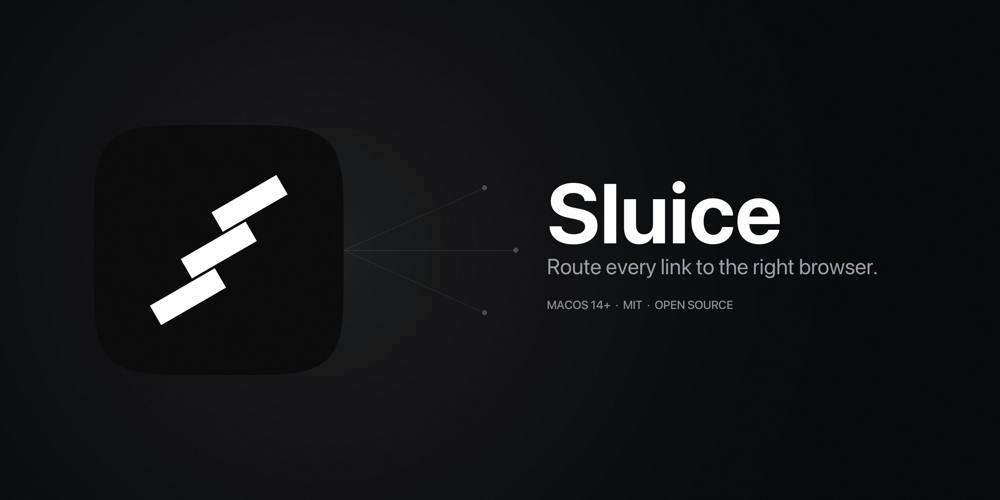

# Sluice

A macOS URL router that opens links from different source apps in different browsers.

**Use case:** "When I click a link in Conductor, open it in Chrome. Everything else — Safari."

## Install

**Homebrew (recommended):**

```sh
brew install --cask mikitahimpel/sluice/sluice
```

**One-line installer:**

```sh
curl -fsSL https://raw.githubusercontent.com/mikitahimpel/sluice/main/install.sh | bash
```

**Manual:** download the latest [release zip](https://github.com/mikitahimpel/sluice/releases/latest), unzip, drag into `/Applications`.

After installing: System Settings → Default web browser → Sluice. Then add routing rules from the menu bar icon.

Requires macOS 14 (Sonoma) or later. Builds are notarized by Apple, so Gatekeeper accepts them without warnings.

## Features (v1)

- Register as system default browser
- Route URLs to any installed browser based on rules
- Match by source app (which app the click came from)
- Match by URL host pattern (`*.figma.com` → Figma desktop)
- Menu bar app — no dock icon, no focus stealing
- Visual rule editor with app/browser pickers
- Recent routes log for debugging
- Hold ⌥ at click time for one-off browser override
- Universal-link / tracking-redirect unwrapping
- Per-Chrome-profile routing
- Import/export rules as JSON

## Architecture

See [docs/ARCHITECTURE.md](docs/ARCHITECTURE.md).

## Building

Requires macOS 13+, Xcode 15+, [XcodeGen](https://github.com/yonaskolb/XcodeGen):

```sh
brew install xcodegen
xcodegen generate
open Sluice.xcodeproj
```

## Testing

Core logic is a Swift Package and tests run without Xcode:

```sh
swift test
```

Discovery / System layer tests run via Xcode:

```sh
xcodebuild test -scheme Sluice -destination 'platform=macOS'
```

## Project layout

- `Sources/SluiceCore/` — pure-Swift rule engine, router, models. No AppKit.
- `Tests/SluiceCoreTests/` — unit tests for Core.
- `Sluice/App/` — `@main` entry point, AppDelegate, Info.plist.
- `Sluice/Discovery/` — Launch Services / NSWorkspace wrappers.
- `Sluice/System/` — default-browser registration, URL opening.
- `Sluice/UI/` — SwiftUI menu bar + preferences.

## Releasing

`scripts/release.sh <version>` does the whole pipeline: builds Release, signs with Developer ID, submits to Apple's notary service, staples the ticket, and writes the final zip to `release-artifacts/`. Then:

```sh
gh release create v<version> release-artifacts/Sluice-<version>.zip
```

The Homebrew Cask formula lives in [mikitahimpel/homebrew-sluice](https://github.com/mikitahimpel/homebrew-sluice) — update its `version` and `sha256` after each release.

## License

MIT
